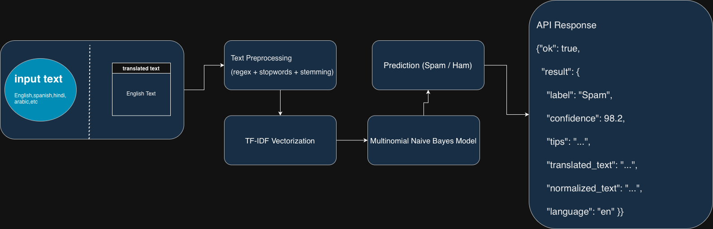
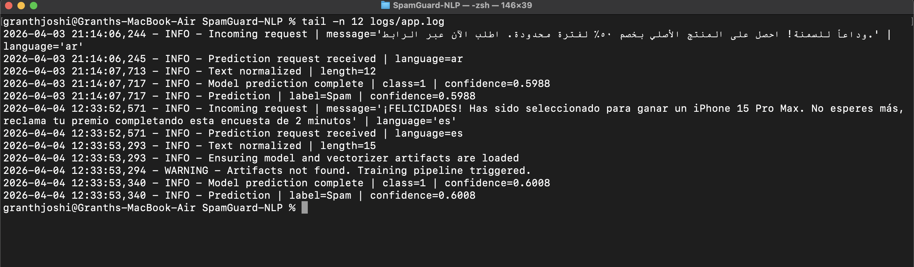

#  SpamGuard-NLP

> A multilingual SMS spam detection system using NLP and machine learning with real-time API inference.


---

**live demo** : https://spam-guard-nlp.vercel.app

---

#  Problem Statement

In today’s digital communication landscape, SMS and messaging platforms are increasingly targeted by spam, phishing attempts, and fraudulent content. Traditional spam detection systems are often limited to **English-only datasets** and struggle to handle **multilingual and code-mixed messages**, which are common in real-world scenarios—especially in regions like India.

Spam messages not only clutter user inboxes but also pose serious risks such as:
- Financial fraud  
- Phishing attacks  
- Data privacy breaches  

---

#  Objective

The goal of this project is to develop a **multilingual SMS spam detection system** that:
- Classifies messages as **Spam or Ham**  
- Handles **multiple languages** via translation and normalization  
- Provides **real-time predictions through an API**  
- Enhances interpretability with **confidence scores and contextual insights**

---

#  Solution Overview

SpamGuard-NLP is an **end-to-end machine learning application with a Flask-based API and web interface** that integrates:
- A complete **data processing and training pipeline**
- A modular **prediction service layer**
- A **Flask-based REST API** for real-time predictions

---


# Pipeline Flow Diagram



---

#  Features

-  Multilingual support via translation (English, Spanish, Arabic, etc.)  
-  Integrated translation for multilingual input handling and normalization  
-  NLP preprocessing   
-  TF-IDF feature extraction  
-  Multinomial Naive Bayes classifier  
-  Real-time prediction via Flask API  
-  Provides confidence scores and additional insights for predictions
-  Modular and extensible architecture  
-  Structured logging for monitoring and debugging  

---

#  Tech Stack

**Languages & Libraries**
- Python  
- scikit-learn  
- NLTK  
- pandas, numpy  

**Backend**
- Flask  

**ML Techniques**
- TF-IDF Vectorization  
- Multinomial Naive Bayes  

---

#  Project Structure


```
SpamGuard-NLP/
│
├── assets/
│   ├── logs.png
│   ├── output.gif
│   ├── pipeline.png
│
├── src/
│   ├── __init__.py
│   ├── config.py
│   ├── data_loader.py
│   ├── evaluate.py
│   ├── logging.py
│   ├── model.py
│   ├── prediction_service.py
│   ├── preprocessing.py
│   ├── training.py
│   ├── translation.py
│   ├── utils.py
│   ├── vectorizer.py
│
├── tests/
│   └── test_prediction_service.py
│
├── static/
│   ├── app.js
│   └── style.css
│
├── templates/
│   └── index.html
│
├── artifacts/          # Saved model (generated)
├── data/               # Dataset (if included)
├── logs/               # Logs (ignored in git)
│
├── app.py              # Flask API
├── main.py             # Training pipeline
├── requirements.txt
├── .gitignore
├── LICENSE
└── README.md
```
---

#  How It Works

1. User inputs a message and selects a language  
2. Message is translated (if required)  
3. Text is cleaned and preprocessed  
4. TF-IDF converts text into numerical features  
5. Model predicts **Spam or Ham**  
6. API returns:
   - Label  
   - Confidence score  
   - Normalized text  
   - Translated text  
   - Tips  

---

#  API Endpoint

### `POST /predict`

#### Request:
```json
{
  "message": "You have won a prize!",
  "language": "en"
}
```
Response:
```
{
  "ok": true,
  "result": {
    "label": "Spam",
    "confidence": 98.2,
    "tips": "...",
    "translated_text": "...",
    "normalized_text": "...",
    "language": "en"
  }
}
```
#  Logging

Structured logging is implemented to track:
- API requests  
- Predictions  
- Errors  

Logs are stored in:

    logs/app.log



# Run locally

```bash
pip install -r requirements.txt
python -m nltk.downloader stopwords
python app.py
```

Then open `http://127.0.0.1:5000`.

## Train the model

```bash
python main.py
```

Training creates `artifacts/model.pkl` and `artifacts/vectorizer.pkl`.

# Future Improvements

- Deep learning models (BERT, LSTM)  
- Cloud deployment  
- Improved multilingual support  
